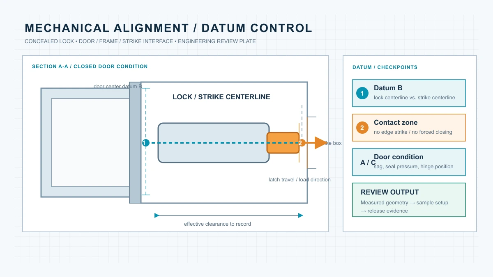
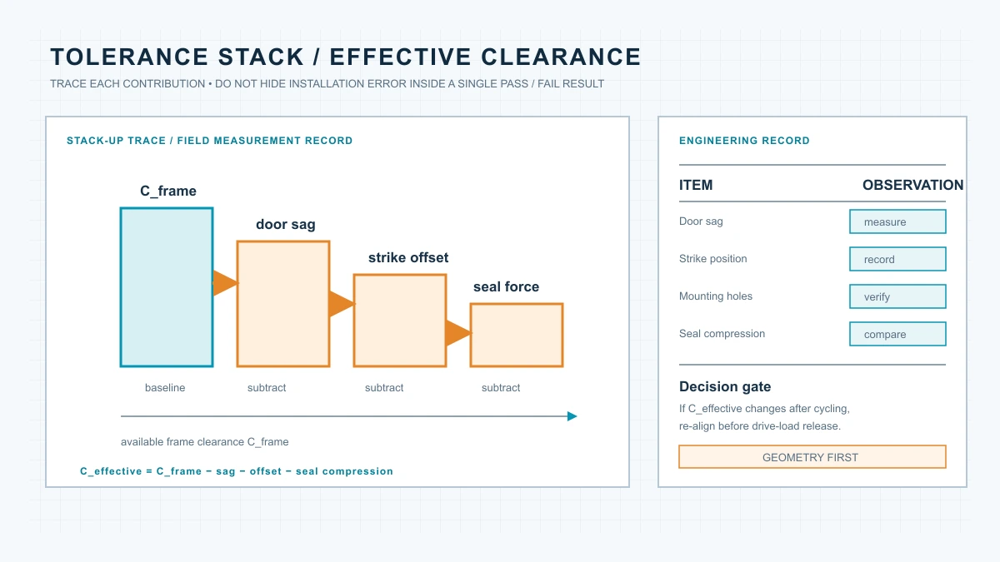
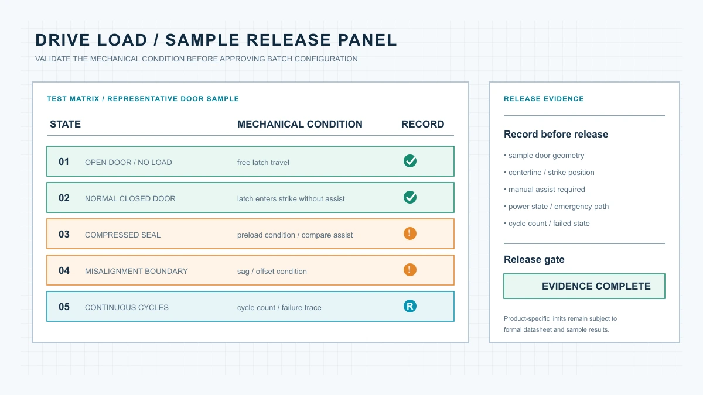

# 隐形智能锁安装几何与驱动负载验证：从门体测量到样机放行

> 本文面向智能锁工程团队、项目采购人员、安装服务商、系统集成商以及 OEM/ODM 品牌方。文章重点不是比较产品外观，而是建立一套可重复的门体测量、安装校准和样机验证方法。



## 为什么“能装进去”不等于“能稳定工作”

隐形智能锁安装在门体内部，外部通常看不到锁体、驱动机构和锁舌传动结构。因此，项目团队容易把“锁体可以放入门内空间”误认为“产品已经兼容”。

但智能锁的稳定运行取决于一整条机械力链：电机或驱动机构输出动力，传动结构推动锁舌或锁栓，锁舌进入门框锁扣盒，而门扇、门框、密封条和铰链共同承担闭门后的预压力。只要其中一个位置发生偏移，电机就可能在锁舌进入锁扣盒之前承受额外负载。

短期内，这类问题可能表现为声音变大、动作变慢或偶发失败；长期则可能造成电池消耗增加、齿轮磨损、门框变形后无法开锁，甚至导致批量项目出现集中售后问题。

因此，隐形锁项目应当把“安装几何”和“驱动负载”作为两个独立但相互关联的验证项目。

## 目录

1. [先确认五个关键几何关系](#geometry)
2. [建立锁体到门框的机械力链](#force-path)
3. [用容差叠加判断安装风险](#tolerance)
4. [设计样机驱动负载测试](#load-test)
5. [WF-019 与 WF-026 的验证重点](#model-validation)
6. [把测量结果写入 RFQ 和样机放行文件](#handover)
7. [结论：先验证门体，再确认批量配置](#conclusion)

## <a id="geometry"></a>1. 先确认五个关键几何关系

### 1.1 锁体中心线

首先应确认锁体中心线与门框锁扣盒中心线是否一致。需要记录门扇厚度、锁体安装高度、锁舌中心线到门边的距离、门框锁扣盒中心线、门扇关闭后的左右偏移，以及门体开启方向和铰链位置。

中心线误差不一定会在开门状态下暴露。门扇打开时，锁舌没有受到门框约束，驱动机构可能看起来运行正常；只有在完全闭门后，偏移才会转化为额外阻力。

### 1.2 锁舌进入深度

锁舌或锁栓需要在门扇完全闭合后顺利进入锁扣盒，并且不能持续顶住锁扣盒边缘。工程记录中应区分：锁舌是否能够进入锁扣盒、进入后是否仍有侧向摩擦、锁舌端部是否撞击锁扣盒底部、门扇是否需要额外推压才能完成上锁，以及解锁时是否需要门扇先释放预压力。

如果必须持续推门或拉门才能完成上锁或解锁，说明问题可能不在电子控制系统，而在门体几何关系或锁扣盒位置。

### 1.3 门扇下垂和铰链偏移

多扇门、厚重门和长期高频使用的门体，可能出现轻微下垂。即使初始安装时中心线一致，使用一段时间后也可能出现锁舌中心线低于锁扣盒、门扇关闭时需要抬门、门框上下间隙发生变化，或锁舌在一个方向上持续摩擦。

因此，样机测试不能只测一次。建议在安装初始、连续循环后和重新调整门铰链后分别记录中心线状态。

### 1.4 密封条压缩量

酒店、公寓和防火门项目常见密封条或门框胶条。密封条压缩后会对门扇产生回弹力，使锁舌进入锁扣盒时的阻力增加。

需要分别测试无密封条压缩、正常闭门、密封条完全压紧，以及门扇被轻微推入后的状态。如果只有在强行推门时才能完成锁定，项目团队就需要重新确认锁扣盒位置、密封条规格或门扇闭合压力。

### 1.5 维护空间

隐形锁并不是“安装完成后永远不需要接触”。电池、控制模块、紧急供电位置和机械应急结构都需要维护空间。在门体测量阶段，应同时标记电池更换方向、盖板拆卸方向、螺丝工具进入空间、线束弯折半径，以及紧急供电或机械钥匙操作空间。

## <a id="force-path"></a>2. 建立锁体到门框的机械力链

智能锁驱动机构实际面对的不是单一阻力，而是多个阻力的叠加：

```text
总驱动阻力
≈ 锁舌与锁扣盒摩擦
+ 密封条回弹力
+ 门扇偏移造成的侧向力
+ 锁体内部传动阻力
+ 门体安装误差带来的附加负载
```

在理想状态下，锁舌进入锁扣盒时主要克服内部传动阻力；在不理想状态下，电机还要同时克服门扇偏移、锁扣盒边缘摩擦和密封条回弹力。

对于电机驱动系统，可以使用以下工程关系进行趋势判断：

```text
T_required ≈ F_resistance × r / η
```

其中，`T_required` 是所需驱动扭矩，`F_resistance` 是锁舌和门体产生的综合阻力，`r` 是传动机构的有效力臂，`η` 是传动效率。

该公式用于理解变量之间的关系，不用于替代具体产品的扭矩测试。不同产品的电机、齿轮、锁舌结构和控制策略不同，最终参数应以样机测试和产品技术文件为准。

## <a id="tolerance"></a>3. 用容差叠加判断安装风险

单个安装误差可能很小，但多个误差叠加后会明显改变驱动负载。一个简化的有效间隙模型可以表示为：

```text
C_effective
= C_frame
- C_door_sag
- C_installation_error
- C_seal_compression
```

其中，`C_frame` 是门框和锁扣盒提供的初始空间，`C_door_sag` 是门扇下垂造成的偏移，`C_installation_error` 是锁体、锁扣盒和安装孔位误差，`C_seal_compression` 是密封条压缩造成的附加影响。

当 `C_effective` 逐渐减小时，锁舌会从“顺畅进入”转变为“边缘摩擦”，再转变为“需要推门或拉门才能动作”。

项目测量表至少应包含：

| 测量项目（示例） | 初始值 | 样机安装后 | 循环测试后 | 备注 |
|---|---:|---:|---:|---|
| 门体厚度 | 45 mm | 45 mm | 45 mm | 示例值，按实际门体复测 |
| 锁体中心线高度 | 与锁扣盒一致 | 偏差 1 mm | 偏差 2 mm | 记录偏移方向 |
| 锁扣盒中心线高度 | 与锁体一致 | 偏差 1 mm | 偏差 2 mm | 示例值 |
| 锁舌进入深度 | 18 mm | 17 mm | 16 mm | 观察是否出现边缘摩擦 |
| 门扇侧向偏移 | 0 mm | 1 mm | 2 mm | 示例值 |
| 密封条压缩状态 | 未压缩 | 正常压缩 | 压缩增大 | 按项目门封规格记录 |
| 电池更换空间 | 可操作 | 可操作 | 可操作 | 不得被门体或盖板遮挡 |

不要只记录“安装成功”或“安装失败”。对于批量项目，更有价值的是保存实际测量值、测试状态和调整方式。



## <a id="load-test"></a>4. 设计样机驱动负载测试

### 4.1 空载测试

在门扇打开、锁舌不接触锁扣盒的情况下运行多次，观察驱动声音是否稳定、锁舌行程是否完整、是否出现卡顿、解锁和上锁动作是否一致，以及电池电压下降后动作是否发生变化。

空载测试只能说明锁体内部基本运行状态，不能代替闭门测试。

### 4.2 正常闭门测试

将锁安装到代表性门体上，在正常闭门状态下测试上锁是否一次完成、解锁后锁舌是否完全回收、门扇是否需要人工推压、连续运行后动作是否变慢，以及不同开启角度和闭门速度是否影响结果。

### 4.3 高阻力边界测试

在不损坏锁体的前提下，应模拟项目中可能出现的高阻力状态，例如密封条完全压紧、门扇轻微下垂、锁扣盒中心线存在偏移、门框局部存在摩擦，或门扇受到轻微侧向压力。

测试目的不是让产品承受无限大的阻力，而是提前发现实际项目中最容易出现的边界情况。

### 4.4 连续循环测试

连续循环测试应记录循环次数、失败次数、失败时门体状态、电池或供电状态、是否需要人工干预，以及调整前后的结果差异。

如果测试中出现偶发失败，不应只通过重新启动或更换电池来消除现象，而应检查锁舌、锁扣盒、门扇和密封条之间的机械关系。



## <a id="model-validation"></a>5. WF-019 与 WF-026 的验证重点

WF-019 和 WF-026 都属于隐形远程锁产品，但它们的验证重点并不完全相同。

### WF-019：重点验证部署简洁性

现有产品资料显示，WF-019 使用 2 节 AA 电池，并以 433 MHz 远程控制为基础配置。针对这类项目，应重点确认门体内部是否有足够安装空间、锁体中心线是否容易保持、电池更换是否方便、远程控制距离是否在真实门体和现场环境中验证，以及可选指纹、密码、NFC 或 App 模块是否已经写入报价和样机配置。

### WF-026：重点验证冗余结构与完整力链

现有产品资料显示，WF-026 采用双系统、双电机结构，并配置 Grade C 机械锁芯。对于这类项目，除了门体几何关系，还需要确认两套驱动系统是否分别完成动作、两个系统之间是否存在机械干涉、电池配置和更换责任是否明确、机械应急解锁是否可操作，以及断电、单系统异常和门体偏移情况下的处理方式。

双系统结构并不意味着可以跳过机械校准。冗余设计只能增加系统可用性，不能消除门体偏移和锁扣盒摩擦带来的负载。

## <a id="handover"></a>6. 把测量结果写入 RFQ 和样机放行文件

为了避免供应商、安装商和项目方对“兼容”产生不同理解，RFQ 和样机确认文件应至少包含门体材质、门体厚度、门扇重量或大致等级、开启方向、铰链形式、门框和密封条结构、现有锁体及锁扣盒尺寸，以及锁体安装位置、中心线高度、锁舌方向、锁扣盒位置、电池和维护空间、紧急解锁方式、线束和模块安装位置。

样机测试信息应包括空载动作、正常闭门、密封条压紧、门体偏移、连续循环、断电或低电量、调整记录和最终照片。

建议把“样机可运行”改写为可验证的交付条件：

```text
样机在代表性门体上完成安装后，
锁舌能够在无持续人工推拉的情况下完成上锁和解锁，
且测试结果、调整项、维护空间和应急操作均已记录。
```

这样可以减少批量交付后才发现安装误差或维护空间不足的风险。

## <a id="conclusion"></a>7. 结论：先验证门体，再确认批量配置

隐形智能锁的工程风险，往往不来自产品外观，而来自门体、锁体、锁扣盒、密封条和驱动系统之间的几何关系。

可靠的验证顺序应当是：

1. 测量门体和门框。
2. 确认锁体中心线。
3. 检查锁舌进入路径。
4. 评估密封条和门扇偏移。
5. 完成空载与闭门测试。
6. 进行边界状态和连续循环测试。
7. 将结果写入样机放行和批量交付文件。

对于 WF-019、WF-026 或其他 OEM/ODM 配置，具体产品参数仍应以正式技术资料和样机测试结果为准。只有当门体几何、驱动负载、维护空间和应急操作都得到验证后，批量采购才具备可控基础。

如需评估具体门体项目，请准备门体厚度、门框照片、锁扣盒尺寸、目标数量、开启方式和所需解锁方式，再进入样机验证阶段。
