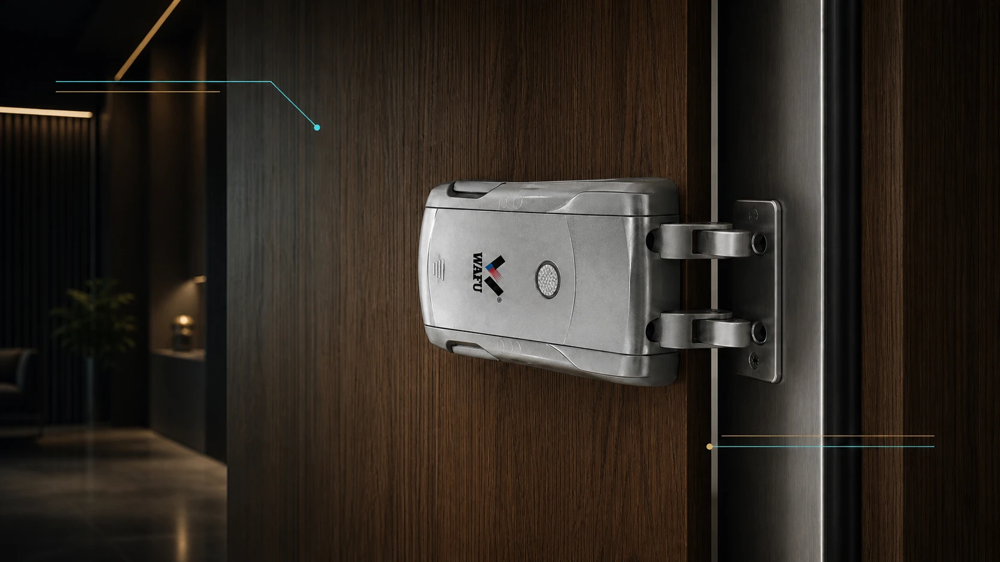
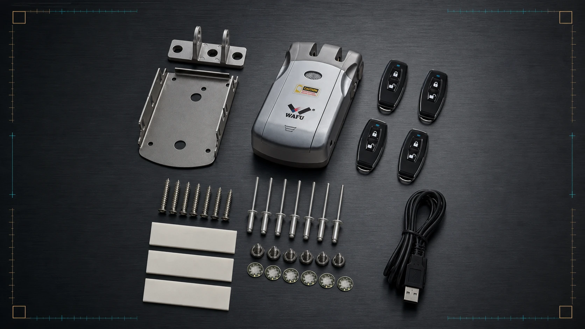

# 隐形智能锁询价前要准备什么：门型、数量、开锁方式与目标市场资料清单

隐形智能锁项目的第一句咨询常常是“这款多少钱”。价格当然重要，但只有型号名称和一个模糊数量，通常不足以形成可以直接下单的报价。门体能否安装、要配什么模块、包装是否需要本地化、样品与量产是否一致，都会影响最终配置、交期和后续维护安排。

对于经销商、项目采购和品牌方来说，一份完整的询价资料并不是增加流程，而是把反复确认前移。供应商能据此判断 WF-010、WF-019、WF-026 中哪些方案适合进入样品评审，并把产品、选配件、包装、备件和技术支持拆开说明。这样拿到的不是一个孤立单价，而是一份可以比较、可以内部审批、也可以转入样品阶段的项目报价。

> **配图位置 1｜产品组合近景（实物底图排版）**
>
> 必须以 WF-010、WF-019、WF-026 的实物图片作为锁体主体，仅进行背景、光影和版式合成；不得重绘产品外壳、挂耳、锁扣结构或颜色。

<!-- 原图来源：images/webp/product-010.webp、images/webp/product-019.webp、images/webp/product-026.webp。 -->

*图 1：WF-010、WF-019 与 WF-026 的实物产品组合。产品本体直接取自各型号原始主图，仅调整画布与排版。*

## 目录

1. [为什么只问单价难以得到可执行报价](#why-price-only-is-not-enough)
2. [询价资料的六个必填模块](#six-inputs)
3. [如何把 WF-010、WF-019、WF-026 放进同一份询价](#model-mapping)
4. [样品、量产与变更控制](#sample-and-production)
5. [比较报价时不要漏掉的项目](#quote-comparison)
6. [可直接提交给供应商的询价清单](#rfq-checklist)
7. [常见问题](#faq)

## 为什么只问单价难以得到可执行报价

同一款隐形智能锁可以因开锁模块、通信配置、包装语言、品牌标识、备件组合和订单批次而形成不同配置。若询价时只写“需要 200 把，报个价格”，供应商往往只能给出参考区间；这类价格未必含有项目真正需要的配件、版本或服务内容，后续补项后又会重新核价。

更重要的是，隐形锁的价值并不只在主机。它安装在门内侧或门体内部，采购前需要先确认门型、开门方向、可用安装空间、锁体结构和现场改造限制。把这些条件留到货到之后，样品通过也不代表批量安装一定顺利。

一份合格 RFQ 的目标应当是回答三个问题：

- 这批锁要装在什么门上、用于什么场景？
- 使用者如何开锁、谁负责管理与维护？
- 哪些内容必须写进报价、样品确认与量产交付？

## 询价资料的六个必填模块

### 1. 目标市场与项目场景

先说明销售或部署国家/地区、项目类型和预计上线时间。市场信息会影响语言、包装、认证资料、售后沟通方式和物流安排；公寓、住宅、办公室或酒店的开锁频次与管理方式也不同。此处不需要在询价阶段替代专业合规判断，但应让供应商知道项目会在哪个市场使用，并要求其明确可提供哪些资料、哪些事项需要采购方另行确认。

### 2. 门体与安装条件

建议提交门型、门厚、材质、开启方向、门边与锁体可用空间、现有锁孔和锁舌位置的现场照片或尺寸图。照片应同时包含门内侧、门边和门框，不要只提供远距离正面照。隐形锁的锁体不应被想象成门外面板锁：安装判断必须围绕门内侧隐藏结构、门边余量和锁舌配合来做。

### 3. 数量、批次与交付节奏

写清首批数量、预计总量、是否分批交付，以及样品和量产的先后关系。对经销商而言，还应区分展示样品、销售库存和售后备用件；对工程项目而言，应明确样板间、试装楼层和批量交付的时间窗口。数量不仅决定价格，也决定包装、备件和产能安排是否应同步考虑。

### 4. 开锁与通信需求

请把“需要智能功能”拆成可选择的方式，例如遥控、指纹、密码、NFC、App、Wi-Fi 或蓝牙等。并非每个功能都是每个型号的标准配置，采购方应要求供应商把可选模块、适配条件和报价状态分别列出。若需要远程管理、第三方平台或特定门禁流程，询价时就应说明，不应默认主机一定包含对应服务。

### 5. 外观、品牌与包装

说明需要的颜色、品牌标识、说明书语言、零售包装或工程包装、条码标签、配件组合和装箱方式。若项目要进入经销渠道，包装与说明资料应在样品阶段一并核验；若是工程交付，则应确认现场交接所需的标签、序列号与批次记录。

### 6. 售后、备件与交付支持

询价资料应写明采购方希望获得的保修起算方式、备件类别、技术文档、远程诊断支持和 RMA 处理要求。具体期限、费用和责任边界不是由文章预先承诺，而是采购方应要求写入合同或订单附件的谈判项。可同时参考[《智能锁 OEM 采购后的售后支持清单》](./smart-lock-oem-after-sales-support-checklist)。

## 如何把 WF-010、WF-019、WF-026 放进同一份询价

询价的作用不是替采购方直接选定型号，而是让供应商围绕项目条件提出可核验的配置。可以将三款产品并列写入需求表，再标注各自承担的角色：

| 采购问题 | 询价时应写明的条件 | 供应商应回复的内容 |
| --- | --- | --- |
| 常规隐藏安装 | 门型、数量、目标开锁方式和预算范围 | WF-010 或 WF-019 的可选模块、样品配置与安装前提 |
| 渠道 SKU 扩展 | 包装语言、品牌标识、首批与补货节奏 | WF-019 的外观/模块选项、包装要求、MOQ 与交期 |
| 冗余方案评估 | 现场维护成本、项目安全要求、远程管理需求 | WF-026 双系统双电机方案的样品验证内容、备件和支持边界 |

WF-010、WF-019 均可作为常规隐藏安装项目的评审起点；WF-019 的模块和包装需求更适合在跨境渠道询价中单列确认。WF-026 的双系统双电机定位不应被简单写成“所有项目都更安全”，而应要求供应商以样品、故障路径演示和项目条件说明其适配性。详细产品资料可分别查看 [WF-010](../products/product-010)、[WF-019](../products/product-019) 与 [WF-026](../products/product-026)。

> **配图位置 2｜样品与安装配件实物示意**
>
> 以现有玻璃门或门内侧实装照片为安装底图。锁体一端的两根圆柱锁舌插入对侧钢制锁扣架的双孔；不得生成两侧都有锁舌的错误结构。

<!-- 原图来源：images/webp/010/15.webp。 -->

*图 2：WF-010 实物套装与安装配件。样品确认时应核验锁体、锁扣架、遥控器、固定件及随附配件。*

## 样品、量产与变更控制

样品不是单纯的展示件。采购方应把样品配置、锁体版本、选配模块、外观、包装、配件和安装条件记录下来，并确认哪些内容将延续到量产。若样品阶段与量产阶段允许替代件或版本变更，也应明确通知、测试和确认方式。

建议把下列项目写入样品确认记录：

- 样品型号、颜色、锁体与 PCB/固件版本（如适用）；
- 开锁模块和通信方式；
- 门体试装结论、需改造项与安装限制；
- 包装、说明书、标签和配件清单；
- 批量订单允许或不允许变更的范围；
- 由谁批准变更、如何保留书面记录。

关于量产前的样品冻结、替代件和变更沟通，可继续阅读[《智能锁 OEM 量产前样品确认与变更控制：采购团队核验清单》](./smart-lock-oem-sample-approval-change-control)。

## 比较报价时不要漏掉的项目

比较报价不应只比“单把价格”。将报价拆成以下五列，采购团队更容易发现遗漏项：

| 比较维度 | 应核验的问题 |
| --- | --- |
| 主机与选配 | 型号、颜色、开锁模块、通信模块、电池是否包含，以及每项是否已计入价格 |
| 安装与配件 | 锁体配件、遥控或其他附件、安装资料、是否需要现场试装支持 |
| 包装与品牌 | 包装形式、语言、标签、说明书、品牌标识与额外打样成本 |
| 交付与备件 | MOQ、样品与量产交期、分批交付、备用件及其单价 |
| 售后与支持 | 质保起算、RMA 流程、故障资料、技术响应和费用责任 |

当两份报价的总价差异明显时，应先逐项核对配置和服务范围，而不是直接认为其中一方“价格更低”。尤其是样品、包装、备件和售后支持，往往会在首批货后才显出差异。

## 可直接提交给供应商的询价清单

将下面清单整理为邮件、表单留言或 RFQ 附件，可显著减少反复确认：

1. 目标国家/地区、项目类型与计划上线时间；
2. 意向型号：WF-010、WF-019、WF-026，或请供应商推荐；
3. 门型、门厚、材质、开启方向及门内侧/门边照片或尺寸；
4. 首批数量、预计总量、分批节奏和样品数量；
5. 需要的开锁方式、通信方式及管理需求；
6. 颜色、品牌标识、包装、说明书和标签语言；
7. 需要确认的认证/市场资料；
8. 试装、安装资料、备件、保修和售后支持需求；
9. 期望报价币种、贸易方式和交期；
10. 当前最大的采购风险或现场难点。

## 常见问题

### 询价时没有完整门体尺寸，还能先拿报价吗？

可以先获得参考配置或价格范围，但应明确这是待门体核验后的初步报价。正式样品和量产前，仍需补齐门型、安装空间和开启方向等信息。

### 是否应该一次把所有开锁方式都选上？

不建议把功能数量当作唯一标准。应先确认用户习惯、管理方式、目标市场和售后能力，再要求供应商明确哪些功能为可选模块，以及它们对价格、维护和版本管理的影响。

### 样品通过后，量产产品会完全一样吗？

这取决于双方是否完成配置冻结和变更控制。采购方应要求把样品版本、配件、包装和允许变更范围书面化，而不是只保留聊天记录或产品照片。

## 获取项目询价资料清单

需要将上述信息整理成可发给供应商的询价表，可前往[联系我们页面提交项目需求](../contact)，并在留言中填写目标市场、门型、项目数量、意向型号和当前难点。提交后，WAFU 团队将根据所提供资料协助梳理适合进入样品评审的配置范围，并安排后续配置沟通；具体回复时间以项目资料完整度和实际工作日为准。

> 本文用于采购沟通与项目评估，不构成认证、合规或法律意见。跨境项目应结合目标市场要求，向专业机构或法律顾问核验。
