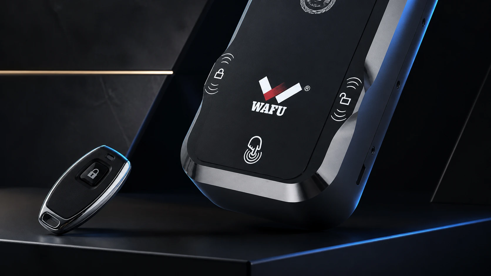
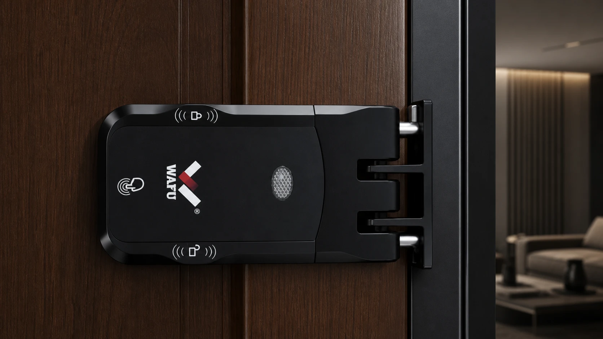

# WF-026 双系统双电机隐形锁适合哪些项目：从单系统升级到双系统双电机的评估框架

并不是每个隐形智能锁项目都需要更复杂的方案。对于门型条件明确、使用方式稳定、现场维护方便的常规项目，经过样品试装和配置确认的单系统方案可能已经足够。真正需要评估 WF-026 的情况，通常不是因为“功能越多越好”，而是项目一旦出现故障，现场响应、住户体验、物业压力或渠道成本会被放大。

WF-026 采用双系统双电机设计，可作为需要进一步验证冗余方案的产品方向。但采购方不应把这一定位直接等同于绝对安全、零故障或适用于所有门体。合理的做法是回到项目条件：哪些风险需要被降低？样品应如何验证？供电、安装、备件和版本变更由谁管理？本文提供一个用于项目评审和询价沟通的框架。

> **配图位置 1｜WF-026 产品近景（实物底图排版）**
>
> 必须保留 WF-026 实物外壳、面板和挂耳的原始形状。没有工程 CAD 或拆机实拍资料时，不制作或暗示真实内部布局的爆炸图。

<!-- 原图来源：images/webp/product-026.webp。 -->

*图 1：WF-026 与遥控器实物图。产品本体直接取自型号原始主图，仅调整画布与排版。*

## 目录

1. [什么时候单系统已经足够](#when-single-system-is-enough)
2. [哪些项目值得评估冗余方案](#when-redundancy-matters)
3. [双系统双电机需要怎样理解](#how-to-evaluate-dual-system)
4. [样品评审应验证哪些故障路径](#sample-validation)
5. [供电、备件与版本控制不能后置](#operations-readiness)
6. [用总拥有成本判断是否值得升级](#tco)
7. [项目评审会前的采购问题](#meeting-checklist)
8. [常见问题](#faq)

## 什么时候单系统已经足够

是否选择冗余方案，应先排除“为了升级而升级”的思路。若项目门数有限、门体一致、日常维护人员就在现场、用户开锁方式清晰且样品试装已经稳定，采购方可以先把重点放在门体适配、配置冻结、安装验收和售后响应上。这些基础工作没有做好，换成更复杂的产品也不会自动消除项目风险。

常规方案进入量产前，仍应确认：

- 门内侧安装空间、门边余量、锁舌配合和开启方向；
- 使用者采用的开锁方式以及相应的账号、遥控或凭证管理；
- 样品与量产的锁体、配件、包装及版本是否一致；
- 低电量提醒、现场维护和应急开启的责任安排；
- 备件、故障诊断与返修流程是否已有明确接口。

有关批量施工和交付后的检查项，可参阅[《批量智能锁项目安装验收清单：门体适配、调试与交付》](./smart-lock-project-installation-acceptance)。

## 哪些项目值得评估冗余方案

以下情况并不自动要求采购 WF-026，但它们说明“故障后再处理”的成本可能较高，值得把冗余方案加入样品评审：

| 项目条件 | 为什么值得进一步评估 |
| --- | --- |
| 分散式住宅或长租物业 | 维护人员到场时间长，单次故障可能影响入住、退租或物业工单 |
| 高端住宅、会所或高安全需求空间 | 住户对稳定性、私密性和服务响应的预期更高 |
| 经销商需要拉开产品层级 | 常规型号与高配置方案需有可说明、可验证的差异，而不是只增加宣传词 |
| 远程管理或复杂运营场景 | 开锁记录、版本、通知与现场响应需要被更系统地管理 |
| 现场改造成本高 | 一旦需要返工或拆装，人工、协调和停用成本可能远高于产品价差 |

评估的重点不是预测一个固定故障率，而是识别项目中“无法快速到场、不能轻易停用、返工代价高”的位置。若这些条件存在，采购方可要求供应商基于 WF-026 样品展示其配置、安装要求和维护边界。

## 双系统双电机需要怎样理解

WF-026 的双系统双电机，是采购团队在方案评估中应要求验证的工程特征，而不是一句可替代测试和合同的营销结论。项目沟通时，应把问题拆开：两个系统在什么条件下工作？异常情况下如何切换或保持可用？需要什么供电与安装前提？哪些情况仍必须由现场人员处理？

供应商的说明至少应能支持以下核验：

1. 样品实际配置与量产拟交付配置是否一致；
2. 正常开锁和异常情形下可演示哪些路径；
3. 项目使用的开锁模块、遥控或网络配置分别如何管理；
4. 电池、应急供电和机械/应急开启路径如何与项目现场规则配合；
5. 发生版本、配件或供应链变更时，采购方如何获知并确认；
6. 需要准备哪些关键备件，以及 RMA 处理时谁负责诊断、物流和更换。

这些问题的答案应来自样品测试、技术资料和合同约定，而不应仅凭产品名称或宣传图做出判断。

> **配图位置 2｜WF-026 横向安装实物示意**
>
> 以 WF-026 真实安装照片为底图，保持锁体横向安装、门把手和门框的实际位置关系；不得自行重构门型或锁止结构。

<!-- 原图来源：images/webp/026/06.webp。 -->

*图 2：WF-026 横向安装实物示意。原图展示不同开门方向下的锁体与门框配合方式。*

## 样品评审应验证哪些故障路径

样品评审不能只做一次成功开锁。对于拟采用冗余方案的项目，应让供应商与采购、安装和运营人员共同确认测试范围，并把结果写入样品记录。可优先验证下列路径：

| 核验主题 | 评审时应观察的内容 |
| --- | --- |
| 门体适配 | 门边空间、锁体固定、方钢/锁舌动作、门框配合和重复开关门表现 |
| 常规使用 | 项目选定的开锁方式是否稳定、提示是否清晰、授权流程是否符合运营习惯 |
| 供电与应急 | 电池更换位置、低电量提示、应急供电与应急开启路径是否可被现场人员执行 |
| 异常演示 | 供应商可演示的故障处理、恢复或切换路径，以及哪些情形必须返修或到场处理 |
| 维护资料 | 序列号、版本、安装记录、故障日志或诊断资料如何留存与交接 |

不要为了追求“覆盖所有故障”而设计脱离现场条件的演示。更有效的做法是，从项目最担心的三到五种中断情形出发，例如夜间无法及时到场、远程管理异常、门体阻力增大、低电量未处理等，逐项确认发现、响应和恢复的责任人。

## 供电、备件与版本控制不能后置

复杂方案的管理难点通常不在首次安装，而在投用后的持续维护。采购方应要求在报价和合同阶段确认电池规格、低电量提示、应急供电、关键备件、版本更新、停产通知和返修时效。不同项目的具体数值和费用归属需要谈判，不应被文章预设为 WAFU 承诺。

建议建立一张项目设备台账，将序列号、门位、安装日期、锁体/固件版本、配置、维修记录和更换件批次关联起来。这样出现批次性问题时，运营方可以先缩小排查范围，再决定是否需要现场服务或返修。关于备件、固件、质保与 RMA 的合同谈判项，可参考[《智能锁 OEM 采购后的售后支持清单：备件、固件、质保与 RMA 如何提前约定》](./smart-lock-oem-after-sales-support-checklist)。

样品确认后，任何涉及锁体、模块、包装或版本的变更都应保留书面记录。具体的样品冻结与变更控制方法，可参阅[《智能锁 OEM 量产前样品确认与变更控制：采购团队核验清单》](./smart-lock-oem-sample-approval-change-control)。

## 用总拥有成本判断是否值得升级

WF-026 是否值得进入项目，不应只比较采购单价。可使用一个简化的总拥有成本框架：

> **总拥有成本 = 产品与选配成本 + 安装/改造成本 + 维护与备件成本 + 故障响应成本 + 停用或体验损失成本**

其中最后两项往往无法用统一金额表示。项目团队可按自身情况评估：一次夜间上门需要多少协调资源？某扇门暂时不可用会影响入住、办公还是运营收入？不同楼栋或城市的现场响应成本是否相同？

当项目维护资源充足、现场可快速处理且门体条件稳定时，常规方案可能更经济；当门点分散、响应代价高或服务体验要求高时，冗余方案的价值更值得纳入比较。结论应以项目数据、样品结果和双方约定为基础，而不是套用固定节省比例。

## 项目评审会前的采购问题

在决定是否把 WF-026 纳入正式方案前，建议向供应商确认：

1. 样品与计划量产版本分别包含哪些锁体、模块和配件？
2. 门型、开门方向、门边空间与锁体安装条件是否已经核验？
3. 供应商可以提供哪些正常及异常路径演示？哪些情况需要现场服务？
4. 项目选定的开锁和管理方式如何配置、交接和维护？
5. 电池、低电量提醒、应急供电和应急开启如何安排？
6. 关键备件、版本记录、变更通知和 RMA 由谁负责？
7. 报价中哪些项目包含，哪些属于选配、样品、包装或服务费用？
8. 批量安装、验收、培训和后续技术支持需要哪些资料？

如果这些问题还没有答案，最稳妥的下一步通常是完成门体资料收集和样品试装，而不是直接把高配置写入批量订单。

## 常见问题

### 双系统双电机是否意味着完全不会出现故障？

不是。任何机电产品都需要正确安装、合理使用、供电维护和售后支持。双系统双电机是可以被项目评估和测试的产品特征，不能替代样品验证、安装验收或售后条款。

### 普通住宅项目可以采购 WF-026 吗？

可以将其纳入比较，但是否适合取决于门体条件、预算、维护方式和使用需求。若没有明确的维护或安全差异化需求，先完成常规方案的样品试装和配置核验更有意义。

### 采购方最容易遗漏的是什么？

常见遗漏是只确认主机功能，没有把供电、应急路径、备件、版本、安装记录和售后响应一起写入项目交付要求。

## 获取 WF-026 项目适配评估表

需要评估 WF-026 是否适合项目，可前往[联系我们页面提交项目需求](../contact)，并在留言中填写项目类型、门数量、门体条件、目标市场、远程管理需求和现场维护方式。提交后，WAFU 团队将根据所提供资料协助整理样品评审前需确认的配置范围和资料清单，并安排后续配置沟通；具体回复时间以项目资料完整度和实际工作日为准。

> 本文用于采购沟通与方案评估，不构成安全认证、合规或法律意见。涉及目标市场法规、隐私、消防或项目验收要求时，应咨询相应专业机构。
